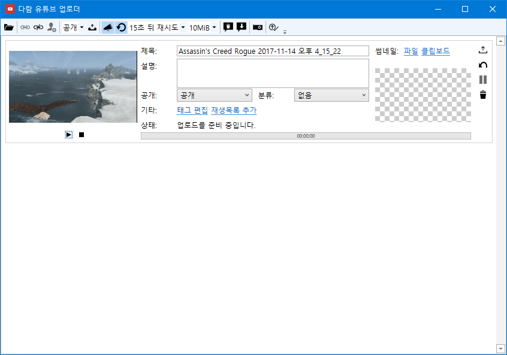

# Daram YouTube Uploader 
YouTube Uploader Application. Only Korean written.

이 프로그램은 [Google YouTube API v3](https://developers.google.com/youtube/v3/docs)를 이용하여 동영상을 업로드하는 프로그램입니다.

모든 개인정보는 저장되지 않으며, 업로드와 재생목록 편집에 사용되는 유튜브 로그인 인증 토큰만이 프로그램과 동일한 디렉토리 내에 저장됩니다.

## 기능
이 프로그램은 다음과 같은 기능을 가지고 있습니다.

* 여러 개의 동영상 동시 업로드
* 적용할 썸네일 이미지를 클립보드에서 가져오는 기능
* 업로드 할 동영상 작게 미리보기
* 업로드 완료까지 남은 시간 보기
* 업로드 완료 또는 실패 시 알림 옵션
* 업로드 완료 후 파일 자동 삭제 옵션
* 모든 동영상 업로드 완료 후 시스템 자동 종료 옵션
